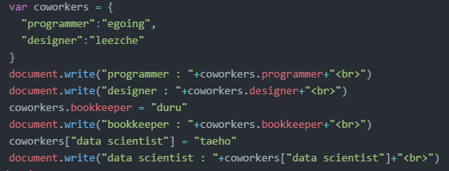
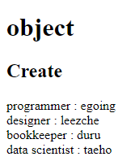
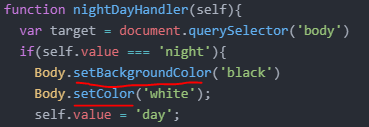
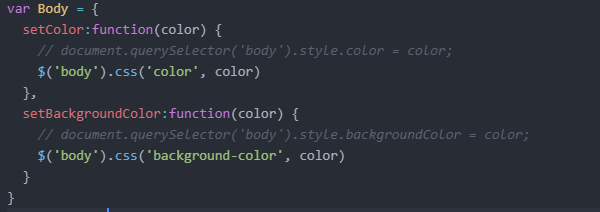

## JavaScript
- 기본적으로 JavaScript는 HTML 위에서 작용한다.
- Web Browser에게 JavaScript라는 것을 인식 시키기 위해서는 `<scipt></scipt>` 태그를 사용

>**ex)**  
>```HTML
><h1>JavaScript</h1>
><script>
>  document.write(1+1);
></script>
><h1>html</h1>
>1+1
>```

#### event
- onclick, onchange, onkeydown 등을 `Event`라고 부름

#### 선택자
- id선택자 > class 선택자 > 태그 선택자 

    | 값 | 사용하는 표현 |
    |---|:---:|
    | `class` | `.class`|
    | `tag` | `tag`|
    | `id` | `#id`|


- id와 class 의 차이
    - `class` = grouping / 포괄적
    - `id` = 한가지 대상을 식별 / 정확한 타게팅, 그룹내 예외

### JavaScript로 선택하기

- JavaScript에서 select tag by css selector
    > element = document.querySelector('Selector')
- JavaScript element style
    > x = document.querySelector('Selector').style
- JavaScript style background-color
    > document.body.style.backgroundColor = "red";


### 조건문
- JavaScript에서 조건문을 쓸때 비교연산자로 `===` 를 쓴다


### 리펙토링 Refactoring
> - 코딩을 하고나면 코드가 비효율적인 면이 생긴다. 그러면 동작 부분은 그대로 두고 코드 자체를 아주 효율적으로 만들어서 코드 가독성을 높히고 유지보수하기 편리하게 만들고, 중복 코드를 낮추는 방향으로 다시 개선하는 작업을 Refactoring 이라고 한다.

### 객체 (Object)
- 중요하지만 굉장히 어려운 Topic
- 정리정돈에 쓰는 함수, 그런 함수 조차 많아지면 더 그룹핑해서 더 잘 정리정돈하는 것이 객체
- 객체에 속해있는 함수는 Method 라고 부른다.
- 이름이 있는 정리 정돈 상자

>   
>   

#### - **Javascript에서 객체는 Python에서 Dictionary와 비슷한 유형인 듯 하다.**

- JavaScript 객체는 Dictionary와 비슷해 보이나 객체에 함수도 담을 수 있다. 
> 객체화 예제 ex)  
>```javascript
>var Body = {
>   setColor:function(color) {
>    document.querySelector('body').style.color = color
>   },
>   setBackgroundColor:function(color) {
>    document.querySelector('body').style.backgroundColor = color
>   }
>}
>```
 
> 사용방법 예제 ex)  
>   


### 정리정돈 도구들
- 함수, 객체 이외에 더 큰 정리정돈 도구. 가장큰 정리정돈 도구
- 서로 연관된 코드들을 파일로 묶어서 Grouping
- 이것을 사용하면 웹페이지가 아무리 많아도 감당가능하게 한다.
- #### **파일로 쪼개기**
- 파일로 쪼갰을때 장점은, src="colors.js"를 포함하기만 하면 된다. 재사용 장점, 유지보수 장점, 가독성, 명확성 증가


### Library & Framework
- `Library` : 정리정돈 되있는 도서관. 만들고자 하는 프로그램에 필요한 어떤 부품들이 되는 소프트웨어를 잘 정리정돈 되어있는 -> 부품을 가져오는 느낌
- `Framework` : 만들고자 하는 것이 있을때, 만들고자하는것이 무엇이냐에 따라서 그것을 만들려고 할때 언제나 필요한 공통적인 것이 있고, 기획 의도에 따라 달라지는 부분이 있을 것인데 그중에서 공통적인 부분은 Framework를 만들어놓고, 만들고자 하는 기능에 따라서 달라지는 부분만 살짝살짝 수정하는 것을 통해서 만들고자하는것을 처음 부터 끝까지 만들지 않게 해주는 거의 반제품과 같은 것이 Framework -> Framework안에 우리가 들어가서 작업

- 결국 다른 사람과 협력하는 모델이다.

#### JavaScript Library
- `jQuery` : Javascript 코딩을 손쉽게 해주는 라이브러리.
> 쓰임의 예제 ex)  
> ```HTML
> <!DOCTYPE html>
> <html lang="en" dir="ltr">
> <head>
>  <script src="https://ajax.googleapis.com/ajax/libs/jquery/3.5.1/jquery.min.js"></script>
> <script src="colors.js"></script>
> </head>
> ```
>  colors.js >
>   

### UI & API
- User Interface & Application Programing Interface
- 사용자가 시스템을 제어하기 위해서 사용하는 조작장치를 User Interface라고 한다
- Application을 만들기 위해서 Programing을 할때 사용하는 조작장치들을 Application Programing Interface 라고 한다.


## CSS

-  `<div>` 무색 무취에 태그 -> 화면 전체를 쓰기때문에 줄바꿈을 함
> **ex)**  
>```html 
> <div>Javascript</div> 
>```
> 

- `<span>` 무색 무취에 태그 -> 전체를 쓰지 않기때문에 줄바꿈을 안함
> **ex)**  
>```html
> <span>Javascript</span>
>```

- `<style>`tag는 마치 `<script>` tag 처럼 web에게 **`<script>`** tag 안에 것 들이 *`css`* 다 라고 말해주는 구분자이다.


